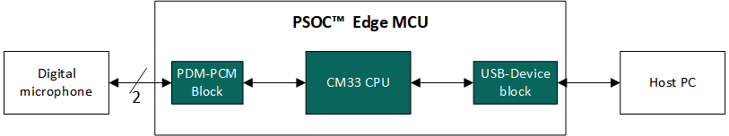
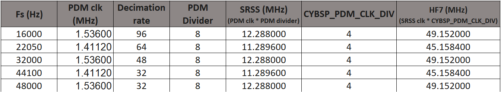

[Click here](../README.md) to view the README.

## Design and implementation

The design of this application is minimalistic to get started with code examples on PSOC&trade; Edge MCU devices. All PSOC&trade; Edge E84 MCU applications have a dual-CPU three-project structure to develop code for the CM33 and CM55 cores. The CM33 core has two separate projects for the secure processing environment (SPE) and non-secure processing environment (NSPE). A project folder consists of various subfolders, each denoting a specific aspect of the project. The three project folders are as follows:

**Table 1. Application projects**

Project | Description
--------|------------------------
*proj_cm33_s* | Project for CM33 secure processing environment (SPE)
*proj_cm33_ns* | Project for CM33 non-secure processing environment (NSPE)
*proj_cm55* | CM55 project

 

In this code example, at device reset, the secure boot process starts from the ROM boot with the secure enclave (SE) as the root of trust (RoT). From the secure enclave, the boot flow is passed on to the system CPU subsystem where the secure CM33 application starts. After all necessary secure configurations, the flow is passed on to the non-secure CM33 application. Resource initialization for this example is performed by this CM33 non-secure project. It configures the system clocks, pins, clock to peripheral connections, and other platform resources. It then enables the CM55 core using the `Cy_SysEnableCM55()` function and the CM55 core is subsequently put to DeepSleep mode.

This code example uses digital microphones with the pulse density modulation (PDM) to pulse code modulation (PCM) converter hardware block. Audio data captured by the microphones is streamed over USB to a PC using the audio device class. An audio recorder software tool, such as [Audacity](https://www.audacityteam.org/), running on a computer initiates the recording and streaming of audio data.

**Figure 1. Block diagram**

The PDM/PCM interface requires two wires: PDM Clock and PDM Data. Up to two digital PDM microphones can share the same PDM data line. The PSOC&trade; Edge MCU samples one microphone on the falling edge and the other on the rising edge.

In this application, the hardware block is configured to sample stereo audio at 16 ksps (default) with 16-bits resolution. The sample audio data is eventually transferred to the USB data endpoint buffer. 

> **Note:** 

- This example supports audio sampling rate up to 48 ksps on PSOC&trade; Edge. See the [Changing sampling rate](#changing-sampling-rate) for changing the sampling rate of the application

- The USB descriptor implements the audio device class with one endpoint:
   - **Audio IN Endpoint:** sends the data to the USB host
   - To view the USB device descriptor and the logical volume info, see the *proj_cm33_ns/source/emusbdev_audio_config.c* file

The firmware consists of a `main()` function, which creates an **Audio App Task**. This task invokes `add_audio()` function to add the audio interface to USB stack. It configures the device descriptor for enumeration using `USBD_SetDeviceInfo()` API. Once the configuration is implemented, **Audio App Task** calls the `audio_in_init()` function to initialize the PDM-PCM block. At the end, it creates the **Audio In Task** and calls the target `USBD_Start()` API to start the emUSB-device stack. This task keeps track of the USB connection/disconnection events by monitoring the suspend and resume conditions on the bus.

**Audio In Task** handles operations of the microphone interface using the `USBD_AUDIO_Write_Task()` function. 

The `audio_in_endpoint_callback()` is called in context of `USBD_AUDIO_Write_Task()` to handle audio data transfer to the host (IN direction). 

The `audio_control_callback()` handles audio class control commands coming from the host. Both of these callbacks are registered when the audio interface is added to the USB stack using `add_audio()` function.

### Changing sampling rate

To change the sampling rate of the USB audio recorder, change the value of AUDIO_IN_SAMPLE_FREQ and AUDIO_OUT_SAMPLE_FREQ declared in *proj_cm33_ns/include/audio.h* file.

#### Configurations for various sampling rates:

The operating frequency for the PDM microphone available on the kit is 1.05 MHz to 1.9 MHz.

The relation between PDM microphone clock and required sampling rate is given in the following equation:

`PDM mic clock frequency = Sampling frequency X Decimation rate`

The required PDM clock is then supplied by setting appropriate values of DPLL_LP1, HF7, and CYBSP_TDM_CONTROLLER_0_CLK_DIV peripheral clock divider values.

Various decimation rates are achieved by setting the decimation factor of FIR and CIC filters of PDM-PCM block.

The clock and PDM-PCM configurations are listed in the following figure for all the supported sampling rates.

**Figure 2. Audio configurations**

